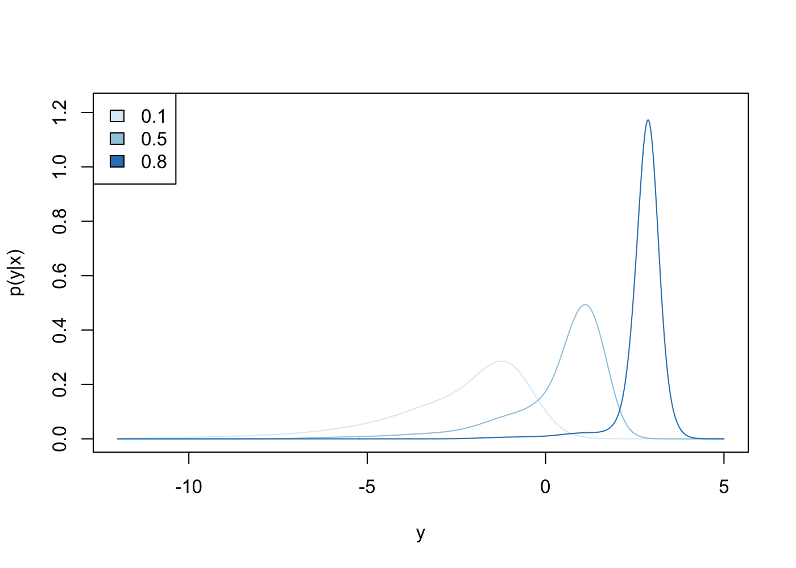

<!-- README.md is generated from README.Rmd. Please edit that file -->

# Density Regression with Bayesian Additive Regression Trees (DR-BART)

This package implements the DR-BART model for density regression as
described in [Density Regression with Bayesian Additive Regression
Trees](https://arxiv.org/abs/2112.12259). Code was written by [Jared
Murray](https://jaredsmurray.github.io) and [Vittorio
Orlandi](https://vittorioorlandi.github.io) and relies on code
originally accompanying [Pratola et. al
(2013)](https://arxiv.org/abs/1309.1906).

<!-- badges: start -->
<!-- badges: end -->

## Installation

You can install `drbart` from
[GitHub](https://github.com/vittorioorlandi/drbart) via:

``` r
# install.packages("devtools")
devtools::install_github('vittorioorlandi/drbart', ref = 'main')
```

## Density Regression

Most regression methods focus on modeling the conditional mean of a
joint distribution *E*(*y* ∣ *x*). While this may be an appropriate
summary of the joint in some cases, there are many instances where other
aspects of the density – like the variance or the skew – change as a
function of covariates and can reveal interesting features of the data.
Density regression is a method for modeling the entire conditional
density *p*(*y* ∣ *x*) and DR-BART is a Bayesian method for doing so via
[Bayesian Additive Regression Trees](https://arxiv.org/abs/0806.3286).
The method is highly flexible, capable of estimating arbitrary
functionals of the conditional densities that may be of interest, and
also yields proper uncertainty quantification about those estimates.

## An Example

We’ll illustrate the package functionality by mimicking one of the
simulations in the paper. We’ll simulate data according to the below:

``` r
# Simulate data from a covariate dependent mixture of a normal and a log gamma
gamma_shape <- function(x) 0.5 + x ^ 2
m <- function(x) 1 + 2 * (x - 0.8)
p <- function(x) exp(-10 * (x - 0.8) ^ 2)
mu0 <- function(x) {
  return(5 * exp(15 * (x - 0.5)) / (1 + exp(15 * (x - 0.5))) - 4 * x)
}

r <- function(x) {
  n <- length(x)
  z <- rbinom(n, 1, p(x))
  return(z * rnorm(n, m(x), 0.3) + 
           (1 - z) * log(rgamma(n, gamma_shape(x), 1)) + mu0(x))
}

n <- 1000
x <- runif(n)
y <- r(x)
```

We can fit a model to estimate *p*(*y* ∣ *x*) by calling the `drbart()`
function. Below, we call the function with default parameters, though
sampling details, prior parameters, and other aspects of the model can
also be user-specified.

``` r
library(drbart)
fit <- drbart(y, x)
```

Given the fitted model, we can estimate the conditional densities we’re
interested in via the `predict.drbart()` method:

``` r
xpred <- matrix(c(0.1, 0.5, 0.8), ncol = 1)
ygrid <- seq(-12, 5, length.out = 500)
preds <- predict(fit, xpred, ygrid)
```

In this case, we’re estimating *p*(*y* ∣ *x* = 0.1),
*p*(*y* ∣ *x* = 0.5), and *p*(*y* ∣ *x* = 0.8) and the argument `ygrid`
specifies the values at which the conditional densities are to be
evaluated. The `predict()` method returns an object of class
`predict.drbart`, which is a list that includes information about the
conditional densities in its `$preds` slot. In this case, the
predictions take the form of an array with dimensions 3 (conditional
densities) x 500 (evaluation points) x 5000 (posterior samples). Via the
`type` argument, `predict.drbart()` can also be used to return
conditional distribution functions, quantiles, and means.

Lastly, the `plot.predict.drbart()` method plots the estimated
conditional densities:

``` r
plot(preds)
```

 We see that
though the mean *E*(*y* ∣ *x*) does change as a function of *x*, it
alone is an insufficient descriptor of the impact of *x* on the response
*y*. DR-BART additionally reveals that with increasing *x*, the
conditional density becomes more sharply peaked and less skewed.
